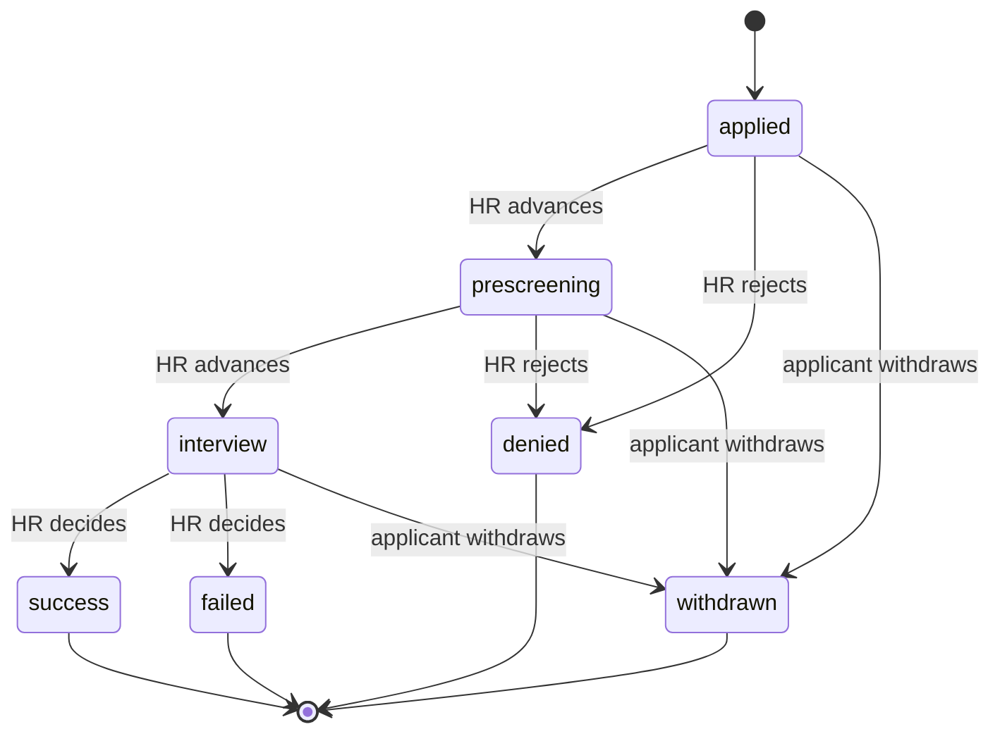

# Applications status pipeline — plan

## Context

The applications domain (already implemented, see `applications-domain.md`) currently has a flat 5-state status: `submitted` → `under_review` → `accepted`/`rejected`, plus `withdrawn`. That's a single review step — it can't represent "HR screened this and moved it forward, then a separate interview stage happened." This plan replaces it with a proper multi-stage hiring pipeline: **applied → prescreening → interview → (success | failed)**, with **denied** as an early-exit rejection before interview.

## Proposed stages

| status | meaning | terminal? |
|---|---|---|
| `applied` | initial state — applicant just submitted (renames `submitted`) | no |
| `prescreening` | HR is doing an initial screen (resume review / screening call) | no |
| `interview` | candidate is in the interview round | no |
| `denied` | rejected **before** reaching interview — didn't pass application review or prescreening | **yes** |
| `success` | passed the interview stage — hired / offer extended (renames `accepted`) | **yes** |
| `failed` | did not pass the interview stage — interviewed but not selected | **yes** |
| `withdrawn` | applicant pulled out, from any non-terminal stage | **yes** |

`under_review` and `rejected` are retired — `under_review` didn't distinguish "being screened" from "being interviewed" (which is the whole point of this change), and `rejected` didn't distinguish "never got an interview" from "interviewed but didn't get it" (which matters for HR's own funnel reporting — how many applicants make it to interview vs. how many pass the interview itself are two different numbers).

## Transition graph

As a transition table (this is what `_ALLOWED_TRANSITIONS` in `service.py` becomes):

| from | HR/admin can move to | applicant can move to |
|---|---|---|
| `applied` | `prescreening`, `denied` | `withdrawn` |
| `prescreening` | `interview`, `denied` | `withdrawn` |
| `interview` | `success`, `failed` | `withdrawn` |
| `denied` / `success` / `failed` / `withdrawn` | nothing (terminal) | nothing (terminal) |

Same rules as before, generalized: HR only ever moves forward (no `interview → prescreening`), HR can never set `withdrawn` (applicant-only), applicants can never set any HR-decision status, and every terminal state is a dead end — no resurrecting a `denied`/`failed`/`success` application.

## What changes (mechanical, no new tables)

- **`enums.py`**: `ApplicationStatus` gets `APPLIED, PRESCREENING, INTERVIEW, DENIED, SUCCESS, FAILED, WITHDRAWN` (7 values, replacing the current 5).
- **`models.py`**: the `ck_applications_status` `CheckConstraint` regenerates from the new enum automatically (it's built from `ApplicationStatus` iteration already) — only the migration needs hand-editing (see below).
- **`service.py`**: `_ALLOWED_TRANSITIONS` becomes a 3-entry dict matching the table above instead of the current 2-entry one. `create()`'s initial status changes from `SUBMITTED` to `APPLIED`. `withdraw()`'s "can withdraw from" check changes from `{SUBMITTED, UNDER_REVIEW}` to `{APPLIED, PRESCREENING, INTERVIEW}`.
- **Uniqueness / reapply rule is unchanged in spirit**: the partial unique index stays `WHERE status != 'withdrawn'` — only `withdrawn` frees the slot, `denied`/`failed` (like `rejected` before them) still permanently block re-applying to that job post. No index change needed, just more terminal values falling under the same "not withdrawn" umbrella.
- **Migration**: `uv run alembic revision --autogenerate -m "expand application status pipeline"` picks up the `CheckConstraint` change automatically (drop old, add new) since it's a plain string column, not an actual DB enum type. Hand-check the diff to confirm it's an `ALTER TABLE ... DROP CONSTRAINT ck_applications_status` + `ADD CONSTRAINT` pair, not something more disruptive.
- **Test suite**: `tests/unit/applications/test_service.py`'s status-transition tests get a 3rd stage added — `test_allows_submitted_to_under_review` becomes something like `test_allows_applied_to_prescreening`/`test_allows_prescreening_to_interview`/`test_allows_interview_to_success_or_failed`, plus a new test for `applied → denied` and `prescreening → denied` (the early-exit path that didn't exist before).

## Data note (dev-only, not a production migration concern)

Existing rows created during earlier smoke testing have `submitted`/`under_review`/`accepted`/`rejected` values that don't map 1:1 onto the new set — `under_review` in particular is ambiguous between `prescreening` and `interview`. Since this app has no real users yet, the simplest path is: don't write a data-backfill migration, just let the `CheckConstraint` swap happen and accept that any pre-existing test rows with old status strings would now violate the new constraint (in practice: this only matters if old rows still exist when the migration runs — worth confirming the DB is clean of stale test applications before applying, or just deleting test rows first). If this were a live production system with real applicant data, this section would instead need an explicit `CASE WHEN old_status = ... THEN new_status ...` backfill before adding the new constraint — flagging that distinction in case this pattern gets reused later for a real breaking status change.

## Open questions

1. **Can HR deny directly from `applied` without ever prescreening?** The transition table above says yes (`applied → denied`) — an obviously-unqualified applicant shouldn't force HR through a prescreening step just to reject them. Confirm this is wanted, or should `denied` only be reachable from `prescreening`?
2. **Single `interview` stage, or multiple rounds?** Your wording named one `interview` stage — this plan keeps it singular (no "interview round 1/2/3" modeling). If multiple rounds need independent tracking later, that's a bigger addition (probably a separate `interview_rounds` table), not a status-enum tweak — out of scope here unless you want it now.
3. **Does `denied`/`failed` need a reason/note field?** Right now HR's `PATCH .../status` call carries only the new status, no explanation. If HR wants to record *why* someone was denied or failed (for compliance or applicant-facing feedback later), that's an additional nullable `decision_note` column — a small addition, but a real scope question, not implied by "stages" alone.

Nothing implemented yet — this describes the change before `enums.py`/`service.py`/the migration get touched.
