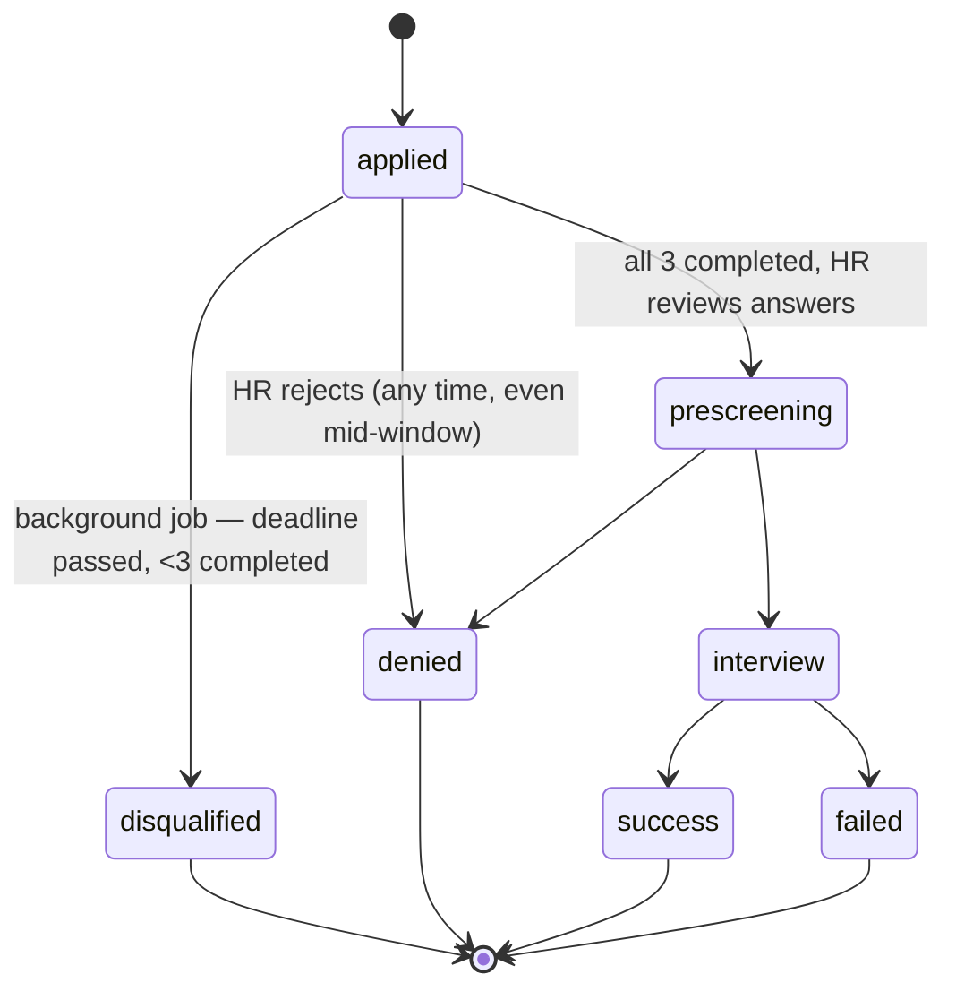

# Assessments domain — plan

## Post-implementation update: grouped under `app/domains/assessments/` + inline template selection

Two further changes on top of the 3-way template split described below:

1. **Directory grouping.** The 3 template domains plus the attempts/answers domain (previously flat top-level siblings under `app/domains/`, alongside `pre_assessment_templates`, `culture_fit_templates`, `technical_assessment_templates`, `assessments`) are now nested under one parent: `app/domains/assessments/{pre_assessment_templates,culture_fit_templates,technical_assessment_templates,attempts}/`. The original `assessments` domain's own files (models/entities/enums/exceptions/repository/service/dependencies/router/schemas — attempts, answers, reopens) moved into an `attempts/` sub-package, since `assessments` itself is now the grouping namespace, not a domain in its own right. This is a deliberate, one-off deviation from the rest of the codebase's flat `app/domains/<name>/` convention (see `CLAUDE.md`) — it applies only to this cluster of 4 tightly-related domains that all orbit "assessments," not a new project-wide pattern. Import paths changed accordingly (e.g. `app.domains.pre_assessment_templates.service` → `app.domains.assessments.pre_assessment_templates.service`, `app.domains.assessments.service` → `app.domains.assessments.attempts.service`); route prefixes, table names, and permission keys were untouched.
2. **Inline template selection at job post creation.** `JobPostCreate` gained three optional fields — `pre_assessment_template_id`, `culture_fit_template_id`, `technical_assessment_template_id` — so HR/admin can select one template of each type directly in the same request that creates the job post, mirroring the existing `tag_ids`/`excluded_job_post_ids` inline-at-create pattern. `JobPostService.create()` validates each id (404 via that template domain's own `NotFoundError` if missing) and attaches it in the same transaction as the job post insert. The 3 dedicated attach/detach endpoints (`POST/DELETE /job-posts/{id}/{type}-templates/{template_id}`) are unchanged and still the only way to change a template after creation — same asymmetry as tags (inline at create, dedicated endpoints for later changes).

## Post-implementation update: templates split into 3 independent domains

Everything below describes the plan as originally built: **one** `assessment_templates` domain with a `type` discriminator column distinguishing pre-assessment/culture-fit/technical. That's since been superseded — templates are now **3 fully independent domains** (`pre_assessment_templates`, `culture_fit_templates`, `technical_assessment_templates`), mirroring the same correction this codebase already made once for `positions`/`tags`/`company_addresses`: distinct business concepts sharing a similar shape don't belong bundled behind a discriminator, even when doing so avoids some duplication.

What actually changed from the design below:
- `assessment_templates`/`assessment_questions` (single pair of tables) → 3 independent pairs, one per domain, each with its own repository/service/router/permission gating — no `type` column needed at all, since which table a row lives in already says which type it is.
- The shared `QuestionType` enum and `validate_question_config`/`validate_answer_value` functions moved to `app/core/question_types.py` — genuinely shared logic that 4 domains need (the 3 template domains + `assessments`), none of which may depend on each other for it.
- `job_post_assessment_templates` (one join table, `type` column, composite PK) → 3 separate join tables (`job_post_pre_assessment_templates`, etc.), each with a **real FK** to its one target table and `job_post_id` as the sole primary key (structurally enforcing "at most one per job post" instead of a separate `UniqueConstraint`).
- `assessment_attempts.template_id` lost its FK — it can't point at one single table anymore (3 possible targets), so a `template_type` discriminator column was added and `AssessmentService` dispatches to the right one of 3 template repositories based on it. This is the one real cost of the split: no DB-level FK enforcement on that column, validated at the application layer instead.
- `JobPost` entity's `assessment_template_ids: list[uuid.UUID]` → three separate optional single-id fields (`pre_assessment_template_id`, `culture_fit_template_id`, `technical_assessment_template_id`), since each is now structurally at most one, not a list.

Everything else — the 3 timing layers, the reopen/audit-log design, the scheduler/Airflow-readiness split, the disqualify/revive flow — is unchanged and still accurate below.

## Context

Before an application reaches human `prescreening` review (per `applications-status-pipeline.md`), the applicant must complete **3 required tests**: a **pre-assessment**, a **culture-fit test** (server-enforced per-question timers), and a **technical assessment**. Templates for these are reusable across job posts (like `Position`/`Tag`), applicants get a shared completion deadline across all 3 (default 4 days, HR-extendable per applicant), and missing the deadline **auto-disqualifies** the application via a real scheduled background job.

Seven decisions were confirmed that shape this design (superseding the earlier draft of this plan):

1. **Timers are server-enforced**, not UI-only — a late answer is rejected.
2. **HR can deny an applicant at any time**, even mid-assessment-window.
3. **Templates are shared/reusable** across job posts — their own independent domain, not owned by a single job post.
4. **Disqualification runs on a real scheduled background job**, not lazily on read.
5. **Every template and every question carries instructions**, and **questions can be answered in different formats** — 8 types covering multiple choice, date, rating, boolean, number, and plain text — not just free text, and the format set needs to stay extensible.
6. **The assessment itself has an overall timer, on top of any per-question timers.** There are now three nested layers of timing — see "Three layers of timing" below.
7. **HR can reopen an `expired` attempt to allow a retry** — layer 2's one-shot deadline isn't truly final; HR has an override, same spirit as extending the outer `assessment_deadline`.

This is now a large addition: **2 new domains**, 5 new tables, a new column each on `applications` and (via a join table) `job_posts`, and new process-level infrastructure (a scheduler) this app has never needed before. Scoped deliberately — see "Explicitly deferred" at the bottom.

## Domain split

Two domains, mirroring the existing `positions`/`tags` vs. `job_posts` separation-of-concerns precedent:

- **`assessment_templates`** — standalone, reusable reference resource (like `Position`/`Tag`): the template + its questions. Full CRUD, `manage_jobs`-gated, zero knowledge of `job_posts` or `applications`.
- **`assessments`** — ties a template to an application: attempts + answers. Depends on `assessment_templates` (read-only, to validate/fetch questions) and `applications`/`job_posts` (one-way, same direction as `job_posts → positions/tags`).

The **job-post-to-template attachment** (`job_post_assessment_templates`) lives inside `job_posts/models.py`, exactly like `job_post_tags` does today — `JobPost` owns the join because "which templates does this posting use" is `JobPost`'s data shape, not the template's.

## Data model

### `assessment_templates` domain

```
assessment_templates
  id, type (pre_assessment|culture_fit|technical), title, description,
  instructions (shown to the applicant before they start this assessment),
  time_limit_minutes (nullable — the WHOLE assessment's overall timer, starts when
                       the applicant opens its first question; null = no overall
                       limit, only whatever per-question timers exist still apply),
  created_at, updated_at

assessment_questions
  id, template_id (FK, CASCADE), order_index, prompt,
  instructions (nullable — per-question guidance, e.g. "select one",
                "rate 1 (strongly disagree) to 5 (strongly agree)"),
  question_type (text|long_text|single_choice|multiple_choice|boolean|number|
                  rating|date),
  config (JSONB, nullable — shape depends on question_type, see below),
  time_limit_seconds (nullable — required/meaningful for culture_fit questions;
                       null means untimed, e.g. pre-assessment/technical questions)
```

**`config`/`answer_value` are JSONB, not a dedicated table per question type** — options/config are always read and written as a whole unit per question (never filtered or joined into individually), which is exactly the shape JSONB fits well, even in an otherwise fully-normalized schema like this app's. Full catalog (8 types — broad enough to cover pre-assessment, culture-fit, and technical questions without needing near-duplicate types for cosmetic reasons):

| `question_type` | `config` shape | `answer_value` shape | notes |
|---|---|---|---|
| `text` | `{"max_length": null}` | string | short, single-line |
| `long_text` | `{"max_length": null}` | string | multi-line — essay answers, "describe a time when...", or a technical write-up. Also what a code-submission question uses (`instructions` says "paste your code"); no separate `code` type — syntax highlighting is a frontend rendering concern, not a backend validation one |
| `single_choice` | `{"options": ["A", "B", "C"]}` | string (must be one of `options`) | radio button *or* dropdown — same backend type, rendering choice is the frontend's call, not worth a second type for |
| `multiple_choice` | `{"options": [...], "min_selections": 1, "max_selections": null}` | list[string] (all in `options`, length within bounds) | checkboxes |
| `boolean` | `{"true_label": "Yes", "false_label": "No"}` (optional) | bool | yes/no, agree/disagree |
| `number` | `{"min": null, "max": null, "step": null}` | number | open numeric input, e.g. "years of experience" |
| `rating` | `{"min": 1, "max": 5, "step": 1, "low_label": null, "high_label": null}` | number within `min`–`max` | bounded Likert-style scale — culture-fit's main tool, kept distinct from `number` because the *intent* (a labeled agreement scale) differs even though both are numeric |
| `date` | `{"min_date": null, "max_date": null}` | ISO date string | optionally bounded |

`file_upload` was considered (a solved-exercise or zipped-repo submission, mirroring the resume-upload pattern) but dropped — not needed for assessments. Removing a type after the fact is symmetric to adding one: a migration narrowing the `CheckConstraint` plus deleting the validation branch, confirmed on an empty table before the constraint change.

**On extensibility**: adding a 10th type later is small but *not* zero-migration — like every other enum-backed status column in this app (`employment_type`, `status` on both `job_posts` and `applications`), `question_type` gets a `CheckConstraint` enumerating valid values, so a new type needs a one-line migration widening that constraint, plus a new validation branch in `AssessmentService`. (Correcting the earlier draft of this plan, which claimed adding types would need *no* migration at all — that's not accurate given this app's consistent pattern of DB-enforcing enum columns, not just Pydantic-validating them at the boundary.)

Full CRUD (`manage_jobs`-gated writes; reads also gated, not public — unlike job posts, these are internal HR-authoring content, not something to expose to anonymous browsers). Deleting a template while it's attached to any job post or has any attempts against it is blocked (`IntegrityError` → `AssessmentTemplateInUseError`, 409) — same asymmetric-cascade rule as `Position`/`Tag`.

### `job_posts` gains a join table (in `job_posts/models.py`, like `job_post_tags`)

```
job_post_assessment_templates
  job_post_id (FK job_posts.id, CASCADE), template_id (FK assessment_templates.id, no cascade),
  type (denormalized copy of the template's type — see note below)
  PRIMARY KEY (job_post_id, template_id)
  UNIQUE (job_post_id, type)
```

`type` is duplicated onto the join row purely so `UNIQUE (job_post_id, type)` can express "at most one template per type per job post" at the DB level — SQL can't constrain "unique per a column on the *joined* table" directly. `JobPostService.add_assessment_template()` is the single place that writes it, always copying from `template.type`, so the two can't drift. Same category of deliberate, commented denormalization as the resume snapshot in the applications domain.

`job_posts` also gains: `assessment_window_days: int` (default `4`) — HR sets this when configuring a job post; it's what each application's deadline is computed from at apply-time.

### `assessments` domain

```
assessment_attempts
  id, application_id (FK applications.id, CASCADE), template_id (FK assessment_templates.id, no cascade),
  status (not_started|in_progress|completed|expired), started_at, completed_at
  UNIQUE (application_id, template_id)

assessment_answers
  id, attempt_id (FK, CASCADE), question_id (FK assessment_questions.id, no cascade),
  question_started_at, answered_at (nullable until submitted),
  answer_value (JSONB, nullable until submitted — shape matches the question's type),
  superseded_at (nullable — set when an HR reopen invalidates this answer; see below)
  UNIQUE (attempt_id, question_id) WHERE superseded_at IS NULL

assessment_attempt_reopens
  id, attempt_id (FK, CASCADE), reopened_by_user_id (FK users.id, no cascade),
  reopened_at (server_default now()), reason (String, NOT NULL — required, not optional)
```

**One answer row per question is created when the question is *started*, not when it's answered** — this is what makes server-side timer enforcement possible: `question_started_at` is stamped the moment the applicant opens question N, `answer_value`/`answered_at` are filled in on submit. If submission arrives after `question_started_at + question.time_limit_seconds` (when the question has a limit), it's rejected — the question stays permanently unanswered for that attempt, no retry.

**`answer_value` is JSONB, its shape matching the `answer_value` column of the table above** (string for `text`/`long_text`/`date`, bool for `boolean`, number for `number`/`rating`, list[string] for `multiple_choice`). `AssessmentService.submit_answer()` validates the submitted value against the question's `question_type`/`config` before saving — a `rating`/`number` outside `config.min`–`config.max` is rejected, a `single_choice`/`multiple_choice` answer not present in `config.options` is rejected (plus `multiple_choice`'s `min_selections`/`max_selections` bounds), a `date` outside `config.min_date`/`config.max_date` is rejected, and `text`/`long_text`/`boolean` just need the right JSON type. One validation branch per `question_type` in the service — this validation lives there, not as a DB constraint, since JSONB content can't be meaningfully `CHECK`-constrained against a sibling row's `config` in Postgres.

**Every read of "the current answers for an attempt" filters `WHERE superseded_at IS NULL`** — the next-unanswered-question lookup, the completion check, and HR's review view all need this filter added. This is the same shape as `applications`' partial unique index (`WHERE status != 'withdrawn'`) — one row generation is "live," everything else is historical but still in the table for audit purposes.

**Questions must be started and answered strictly in `order_index` order, one at a time.** You can't open question 3 before question 2 is answered-or-expired. This is what stops an applicant from opening every question at once to "bank" time against a shared timer — each question's clock only starts when that specific question is reached. Worth confirming this is the intended UX (see open questions).

`applications` gains: `assessment_deadline: datetime | None` — set once in `ApplicationService.create()` to `now() + job_post.assessment_window_days`. This is the **one shared deadline covering all 3 attempts**, not three separate deadlines.

`applications` also gains a new table, symmetric to `assessment_attempt_reopens` and living in the same domain as `assessment_deadline` itself:

```
assessment_deadline_extensions
  id, application_id (FK applications.id, CASCADE), extended_by_user_id (FK users.id, no cascade),
  extended_at (server_default now()), reason (String, NOT NULL),
  previous_deadline, new_deadline
```

`ApplicationService.extend_assessment_deadline()` now requires `reason` in the request body alongside `new_deadline`/`extend_by_days` (still exactly one of those two, per the earlier decision) — it snapshots the current `assessment_deadline` as `previous_deadline`, computes and writes the new value, and inserts the log row, all in the same commit. Same reasoning as attempt reopens: a bare "deadline changed" without who/when/why is a weak audit trail for an HR override with real consequences (it's the difference between an application getting auto-disqualified or not).

### Three layers of timing

There are now three independent, nested time constraints, from outermost to innermost:

| layer | field | scope | example |
|---|---|---|---|
| 1. Application window | `applications.assessment_deadline` | covers all 3 assessments combined | "complete pre-assessment + culture-fit + technical within 4 days of applying" |
| 2. Assessment (attempt) timer | `assessment_templates.time_limit_minutes` | one assessment, starts when its first question opens | "once you start the technical assessment, you have 60 minutes to finish all its questions" |
| 3. Question timer | `assessment_questions.time_limit_seconds` | one question, starts when that question opens | "you have 90 seconds to answer this culture-fit question" |

Each layer is checked independently and the most restrictive applicable one wins. Starting the *first* question of an attempt is what stamps `assessment_attempts.started_at` and flips it to `in_progress` — that's the moment layer 2's clock starts, not attempt-creation time (attempts are created for all 3 templates immediately on `POST /applications`, but sit `not_started` — and un-timed — until the applicant actually begins one).

**Layer 2 is a hard, one-shot deadline for the applicant** — if `now() > started_at + time_limit_minutes` before every question is answered, the attempt becomes `expired`. There's no self-service "pick up where you left off." Since the *application-level* disqualification check (layer 1) only cares whether all 3 attempts reached `completed`, an `expired` attempt counts exactly like a never-started one — that path to `disqualified` locks in once the outer deadline passes, **unless HR reopens it**.

**HR can reopen an `expired` attempt** — `POST /assessment-attempts/{id}/reopen` (`manage_applications`), body `{"reason": "..."}` (**required**, not optional — a bare "who/when" without "why" is a weak audit trail for something this consequential). Resets the attempt to a clean `not_started` state: `started_at`/`completed_at` cleared, a full restart not a resume, consistent with the no-partial-credit philosophy already established for individual expired questions. No cap on how many times HR can do this for a given attempt.

**This is logged for audit, and the reset doesn't destroy data** — two things happen atomically:
1. Every non-superseded `assessment_answers` row for that attempt gets `superseded_at = now()` (soft-invalidated, not deleted — see above). The applicant's prior answers stay in the table forever, just excluded from "current" queries.
2. A new `assessment_attempt_reopens` row is inserted: which attempt, which HR user (`current_user.id` from `get_current_user`), when, and the required `reason`.

`GET /applications/{id}/assessments` (both HR's and the applicant's own view) includes each attempt's reopen history — `reopened_by`, `reopened_at`, `reason` per past reopen — so the audit trail is actually visible somewhere, not just write-only rows in a table nobody reads.

**Reopening only works while the parent application is still `applied`** — if the outer deadline (layer 1) has already passed and the application was auto-disqualified, `disqualified` is a terminal status like `denied`/`success`/`failed`/`withdrawn`, and reopening one attempt doesn't resurrect it. This keeps "terminal means terminal" intact: reopening fixes the case where one assessment's *own* faster clock ran out while the applicant still had days left in the outer window, not a general undo for a fully disqualified application. If HR also needs to revive an already-`disqualified` application, that's extending `assessment_deadline` *and* reopening the relevant attempt(s) — two separate, composable actions, not one. Rejecting a reopen attempt on an already-disqualified application raises `InvalidAssessmentAttemptReopenError` (`ValidationError`, 400).

**The same scheduled job that checks layer-1 disqualification also sweeps layer-2 expirations** — `disqualify_expired_applications()` (see below) additionally finds `assessment_attempts` where `status = 'in_progress' AND started_at + template.time_limit_minutes < now()` and flips them to `expired`. This is on top of a defensive check on the request path itself: `POST .../start` and `POST .../answer` both re-check the attempt's own clock before acting, so an attempt doesn't need to wait for the sweep to correctly reject actions after its time is up — the sweep exists so an attempt's status is eventually correct even if the applicant never comes back to trigger that check themselves (relevant for however HR's review list decides to display "still in progress" vs. "expired").

## Updated pipeline diagram



Completing all 3 assessments still does **not** auto-advance the application — HR reviews the submitted answers (whatever format each question used) and manually calls `update_status` to move `applied → prescreening`, same mechanism as before.

## The scheduled background job — built to be migrated to Airflow later

This app has never needed a job runner before (RBAC checks, the only other "automatic" behavior, are done live on the request path). **Confirmed: the current in-process scheduler is a placeholder — the actual cron responsibility is moving to Airflow, running as its own service outside FastAPI, once that's set up.** So the design goal here isn't "add APScheduler," it's "separate *what the job does* from *what triggers it*," so swapping the trigger later is a deletion, not a rewrite.

**A real dependency-direction problem this surfaces**: checking "is this application fully assessed" needs `assessments` data, but *transitioning* the application to `disqualified` is `applications`' own responsibility. If `ApplicationService` reached into `assessments` to check attempt completion, that would create `applications → assessments`, directly contradicting the already-established `assessments → applications` direction (attempts reference `application_id`) — a cycle. Resolution: **neither service depends on the other for this.** Each domain only gets a narrow, self-contained method:

- `AssessmentService.expire_overdue_attempts()` — layer 2, pure `assessments`-domain logic: finds `assessment_attempts` where `status = 'in_progress' AND started_at + template.time_limit_minutes < now()`, flips them to `expired`. No knowledge of `applications`.
- `AssessmentService.is_application_fully_assessed(application_id)` — pure `assessments`-domain read: are all of this application's required attempts `completed`? Still no knowledge of what "disqualify" means.
- `ApplicationService.disqualify(application_id)` — pure `applications`-domain logic: verify the application is still `applied`, set `disqualified`, commit. No knowledge of `assessments`.

**The cross-domain sequencing lives in a composition root, not in either service** — exactly the role `create_admin.py` already plays (it wires `UserRepository` + `RoleRepository` together without either domain depending on the other). Two new standalone scripts, each independently runnable and each mapping to what will become one Airflow task:

- `app/scripts/expire_overdue_assessment_attempts.py` — `uv run python -m app.scripts.expire_overdue_assessment_attempts`. Opens its own `AsyncSessionLocal()` (not `get_db()`, no request context — same reasoning as `create_admin.py`, including the Windows `SelectorEventLoop` fix), constructs `AssessmentService`, calls `expire_overdue_attempts()`.
- `app/scripts/disqualify_overdue_applications.py` — `uv run python -m app.scripts.disqualify_overdue_applications`. Constructs *both* `AssessmentService` and `ApplicationService` against one shared session, finds applications past `assessment_deadline` still `applied`, calls `assessment_service.is_application_fully_assessed(id)` for each, and calls `application_service.disqualify(id)` for the ones that fail. This script is the only place in the codebase that knows about both domains for this purpose.

**Two scripts, not one combined script** — deliberately, so the eventual Airflow DAG can model `expire_attempts_task >> disqualify_applications_task` as two real, independently retriable/observable tasks (Airflow's actual idiom), rather than one opaque script hiding the ordering internally.

**For now, pre-Airflow**: a thin `app/core/scheduler.py` using APScheduler's `AsyncIOScheduler`, registered from `app/main.py`'s lifespan, imports and awaits both scripts' `main()` functions in order every 15 minutes. Not Celery — no broker/worker process to stand up for something this simple; APScheduler just runs a coroutine inside the existing `uvicorn` process. This file contains *zero* business logic — it's purely "call these two things on a timer" — which is exactly why it's the only thing that gets deleted when Airflow takes over. At that point: remove the lifespan registration, point two Airflow tasks at the same two scripts (`BashOperator` shelling out to `uv run python -m app.scripts.X`, or a `PythonOperator` importing and awaiting `main()` directly if Airflow shares this codebase/environment), done — zero changes to `app/domains/assessments`/`app/domains/applications`.

Known limitation of the pre-Airflow placeholder: APScheduler's in-process default assumes one API instance — a multi-instance deployment would fire each job once per instance. Not a concern once Airflow (a real single-scheduler system) takes over; noted here only because it's a real gap in the interim state.

## API surface (sketch)

**`assessment_templates` domain** (`manage_jobs`-gated, all of CRUD — no public read):
- `POST/GET/PUT/DELETE /assessment-templates` (+ `/{id}`) — standard CRUD, same shape as `positions`/`tags` (now including `instructions` and `time_limit_minutes`)
- `POST /assessment-templates/{id}/questions` — add a question (`prompt`, `order_index`, `instructions?`, `question_type`, `config?`, `time_limit_seconds?`) — `config` is validated against `question_type` at creation time too (e.g. `multiple_choice` must include a non-empty `options` list), so a malformed template can't be built in the first place

**`job_posts`** (`manage_jobs`-gated):
- `POST /job-posts/{id}/assessment-templates/{template_id}` — attach (validates template exists, no existing attachment of that `type` already present → `AssessmentTemplateTypeAlreadyAttachedError`, 409)
- `DELETE /job-posts/{id}/assessment-templates/{template_id}` — detach

**`applications`**:
- `PATCH /applications/{id}/extend-assessment-deadline` (`manage_applications`) — body: `reason` (required) plus **either** `new_deadline` (absolute, e.g. `"2026-09-12T00:00:00Z"`) **or** `extend_by_days` (relative, e.g. `2`, added to the *current* `assessment_deadline`, not to `now()` — so extending twice compounds correctly) — a Pydantic model validator rejects the request if both or neither of `new_deadline`/`extend_by_days` are given
- `GET /applications/{id}/assessments` (owner or `manage_applications`, reuses `ApplicationService.get()`'s existing check) — the 3 attempts + their questions/answers-so-far, **plus both audit trails**: each attempt's reopen history (`assessment_attempt_reopens`) and the application's deadline-extension history (`assessment_deadline_extensions`) — the one place both logs are actually surfaced, not just written and forgotten

**`assessments`** (attempt actions, owner-only):
- `POST /assessment-attempts/{id}/questions/{question_id}/start` — first checks the *attempt's* own clock (layer 2 — rejects with `AssessmentAttemptExpiredError` if `time_limit_minutes` has elapsed since `started_at`), then stamps `question_started_at` (layer 3) and rejects if it's not the next unanswered question in order; on the very first question of an attempt, also stamps `assessment_attempts.started_at` and flips it to `in_progress`. Response includes the question's `prompt`/`instructions`/`question_type`/`config` so the client knows how to render it
- `POST /assessment-attempts/{id}/questions/{question_id}/answer` — submits `answer_value`; rejects if the attempt's overall timer has expired, if past that specific question's timer, if it's not the currently-started question, or if the value doesn't validate against `question_type`/`config`
- The attempt auto-flips to `completed` (sets `completed_at`) once its last question is answered-or-expired — no separate explicit "submit" call needed given the strict one-at-a-time ordering

**`assessments`** (HR override, `manage_applications`-gated):
- `POST /assessment-attempts/{id}/reopen` — body `{"reason": str}` (required). Resets an `expired` attempt to `not_started`, clears timestamps, supersedes (not deletes) its answers, and logs the action to `assessment_attempt_reopens`. Rejects with `InvalidAssessmentAttemptReopenError` if the attempt isn't `expired`, or if the parent application is already `disqualified`.

## Explicitly deferred (not in this plan)

- **Auto-grading / pass-fail scoring** — even with structured types like `rating`/`multiple_choice`, there's no "correct answer" or numeric score computed automatically. HR still reads every answer (now richer than plain text) and decides via `update_status`. A future "this multiple-choice question has a correct option, auto-score it" feature is a separate addition on top of `config`, not included here.
- **Question types beyond the 9 listed** — no `ranking` (drag-to-order a list), no `matrix`/grid questions (a table of sub-questions sharing one rating scale), no `time`/`datetime` (only plain `date`). These are real question types other survey/assessment tools support, but each adds meaningfully more validation/UI complexity than the 9 above for unclear payoff here — easy to add later (one migration + one validation branch each) if a real need shows up.
- **A real Airflow DAG** — not part of this plan/codebase at all; this plan only guarantees the FastAPI side is shaped so that migration is a deletion (`app/core/scheduler.py`) plus pointing two Airflow tasks at two already-existing scripts, not a rewrite.
- **Editing/deleting a logged reopen or deadline extension** — both audit tables are append-only, same as everything else in this app has no "edit history" concept. Once logged, a reason/timestamp is permanent.

## Decisions — all resolved

1. **Scheduler interval**: every 15 minutes.
2. **Sequential one-at-a-time question ordering**: confirmed — can't open question 3 before question 2 is answered-or-expired.
3. **Expired questions fail silently**: no special "time's up" payload — the attempt just marks the question permanently unanswered and the next `start` call returns the next question normally.
4. **Deadline extension shape**: both — see the endpoint above, exactly one of `new_deadline`/`extend_by_days` required per request.
5. **Only culture-fit questions get a per-question timer by default** (`time_limit_seconds` null elsewhere) — confirmed by no objection; the overall assessment timer (`time_limit_minutes`) is separate and available to all 3 template types.

Nothing implemented yet — this is now a complete design ready to build.
